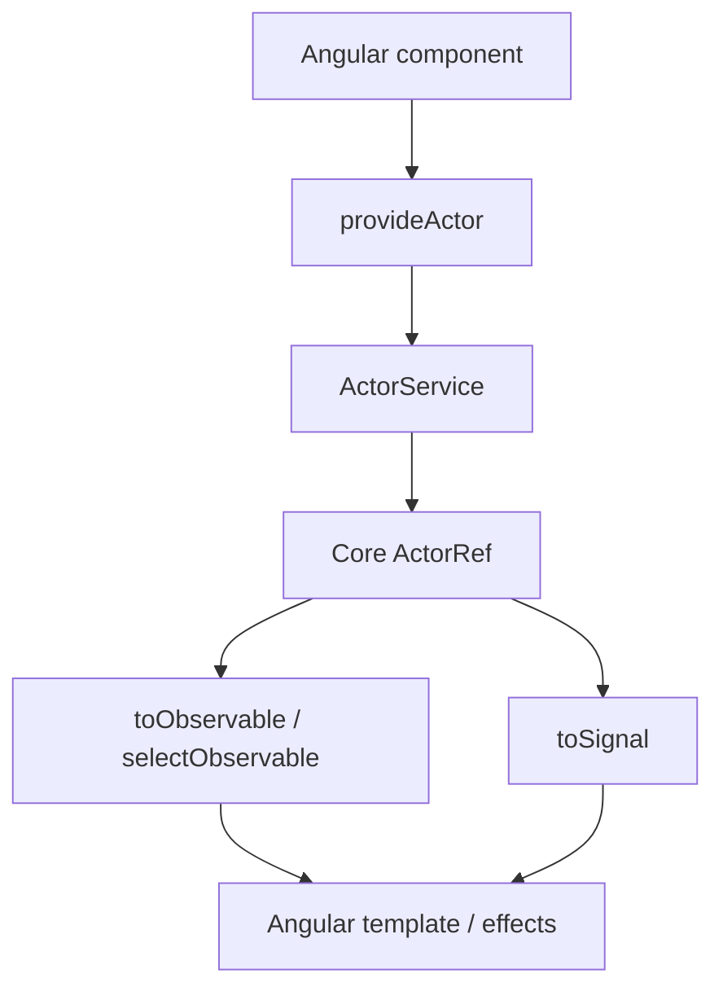

# Angular Adapter Design

## Overview

`@stategraph/angular` wraps the core actor contract with Angular DI, RxJS, and signal helpers. It follows ADR-009 and must not alter runtime semantics.

## Public API

```ts
provideActor(machine, options?)
ActorService
toObservable(actor)
selectObservable(actor, selector)
toSignal(actor, selector?)
```

## Hook Behavior



`provideActor` binds actor creation to Angular DI. `ActorService` owns lifecycle and exposes a snapshot stream plus `send`. The observable and signal helpers adapt the same actor contract without introducing alternate runtime semantics.

## Implementation Notes

Use Angular lifecycle hooks and DI cleanup to stop actors and subscriptions. Keep RxJS and signal helpers as thin adapters over the same snapshot contract.

## Testing Strategy

Use Angular test utilities plus the shared adapter conformance suite from `@stategraph/testing`. Tests requiring browser APIs should use a browser-like environment when needed.
