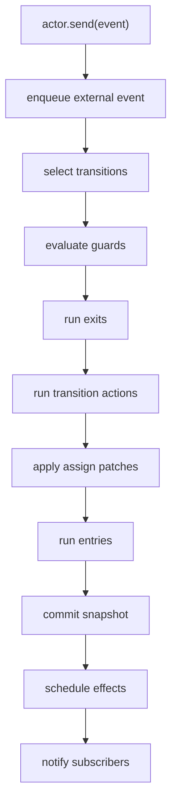

# Core Runtime Design

## Overview

`@stategraph/core` owns the public runtime semantics. It follows ADR-001 through ADR-004 and the runtime requirements in `TECHNICAL_REQUIREMENTS.md`.

## Public API

MVP exports:

```ts
setup()
createMachine(definition)
createActor(machine, options?)
assign(mapper)
fromPromise(fn)
fromCallback(fn)
fromObservable(fn)
```

Actors expose:

```ts
actor.start()
actor.stop()
actor.send(event)
actor.getSnapshot()
actor.subscribe(listener)
actor.select(selector, listener)
actor.inspect(listener)
```

## Runtime Pipeline



## Internal Components

- Machine normalizer and validator.
- State node registry and path resolver.
- Event queue with run-to-completion processing.
- Transition selector with stable candidate priority.
- Context assignment executor.
- Effect scheduler with cancellation handles.
- Snapshot builder.
- Selector subscription registry.
- Trace emitter hook.
- IR exporter.

## Data Contracts

Snapshots implement ADR-004 exactly. Context is immutable from the consumer perspective. Effect implementations are resolved from `setup()` defaults plus actor-level `provide` overrides.

## Error Handling

Definition errors, invalid targets, missing implementations, guard/action/effect errors, and unhandled runtime errors must be surfaced in snapshots and traces where applicable. Missing guard/action/effect implementations throw at `createActor` time with named diagnostics.

## Testing Strategy

Core tests cover transition priority, action order, guards, targetless transitions, self transitions, parallel determinism, history restoration, delayed events, child lifecycle, effect cancellation, snapshots, selectors, and trace replay.
