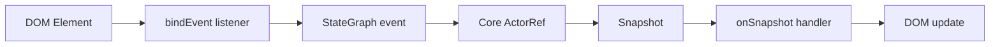

# DOM Adapter Design

## Overview

`@stategraph/dom` provides framework-free helpers around the core actor contract. It owns DOM event listeners and cleanup, but all statechart semantics remain in `@stategraph/core`.

## Public API

```ts
mountActor(machine, options?): { actor, cleanup }
bindEvent(element, domEventType, actor, stateEvent): () => void
onSnapshot(actor, handler): () => void
```

## Data Flow



## Lifecycle

`mountActor` creates and starts an actor and returns an idempotent cleanup function. `bindEvent` and `onSnapshot` return independent unsubscribe functions. If users compose these manually, each cleanup path must be safe to call once or more.

## Error Handling

Invalid elements or missing actor capabilities should fail with descriptive errors. Runtime errors come from the core actor and are not reinterpreted by DOM helpers.

## Testing Strategy

Use Vitest with `jsdom` or `happy-dom`. Tests cover shared conformance and DOM event listener behavior.
