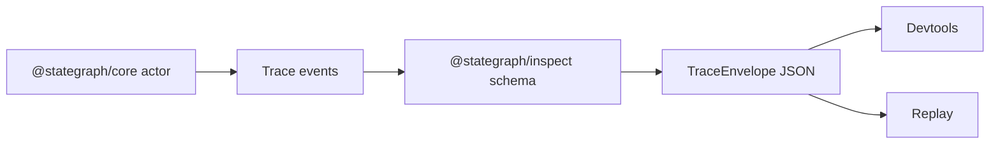

# Inspect Trace Design

## Overview

`@stategraph/inspect` owns versioned trace schemas and transport-independent inspection utilities. The runtime emits trace data; inspect defines and validates the canonical shape. This follows ADR-005.

## Public API

```ts
parseTraceEnvelope(raw: unknown): TraceEnvelope
serializeTrace(envelope: TraceEnvelope): string
deserializeTrace(raw: string): TraceEnvelope
createLocalInspectorTransport(options?)
UnsupportedSchemaVersionError
```

## Trace Model

Trace envelopes use `schemaVersion: '1.0'` for MVP. Trace event discriminants include:

- `@actor.started`
- `@actor.stopped`
- `@event.received`
- `@transition.fired`
- `@action.executed`
- `@effect.started`
- `@effect.done`
- `@effect.error`
- `@effect.cancelled`
- `@context.updated`
- `@error`



## Versioning

Maintain Zod parsers for current major and previous major once a second major exists. Major changes reject incompatible traces. Minor additions must be optional or backward compatible.

## Error Handling

Invalid schema versions throw `UnsupportedSchemaVersionError`. Invalid envelope shape throws a validation error that includes the failing path where available.

## Testing Strategy

Tests cover valid v1 envelopes, invalid event discriminants, missing required fields, unsupported major versions, optional minor fields, serialization round trips, and local transport message flow.
