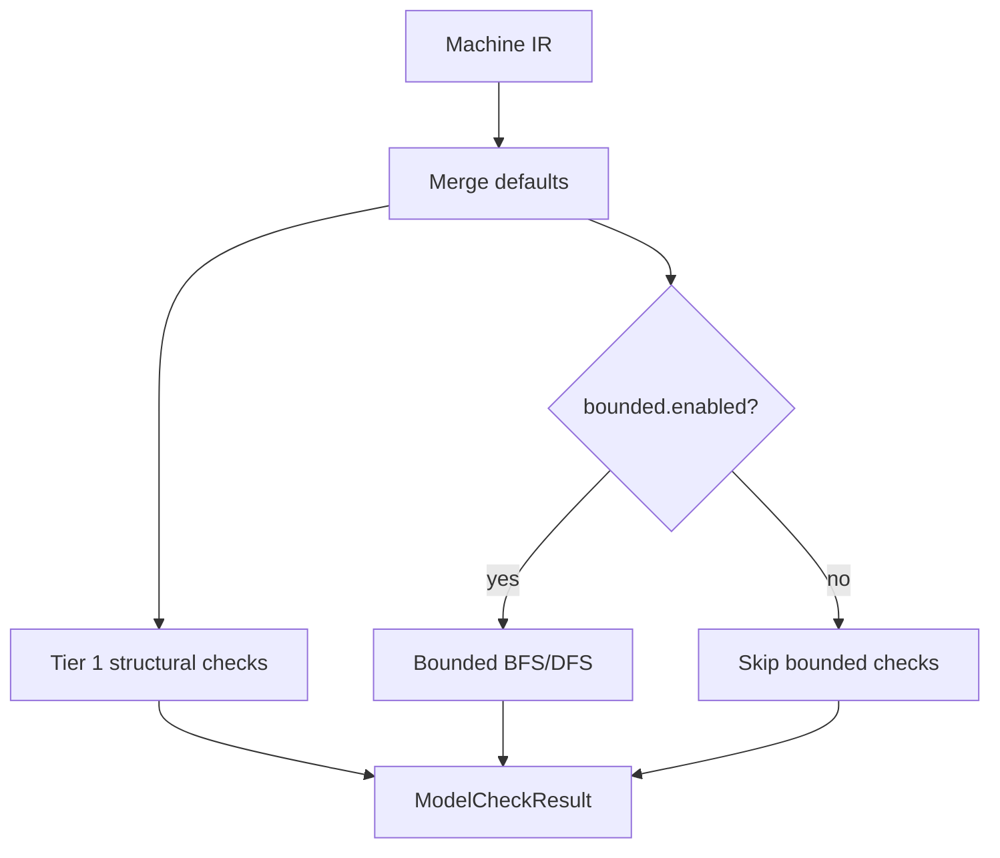

# Model Check Design

## Overview

`@stategraph/model-check` performs practical analysis over StateGraph machine IR. It follows ADR-006: fast Tier 1 checks by default and opt-in bounded reachability for deeper exploration.

## Public API

```ts
check(machineOrIr, config?): ModelCheckResult
getDefaultModelCheckConfig(): ModelCheckConfig
```

## Analysis Flow



## Diagnostics

Diagnostics use stable `code` values and include state IDs or transition metadata where possible. Error diagnostics block a clean CI pass. Warning diagnostics are informational.

## Limits

Bounded analysis is intentionally incomplete when limits are reached. The implementation must set `stats.hitLimit` and include analysis counts and duration.

## Testing Strategy

Tests use fixture machines for unreachable states, dead states, invalid targets, missing initial states, nondeterminism, superseded transitions, warning-only effects, bounded success, and bounded limit hits.
