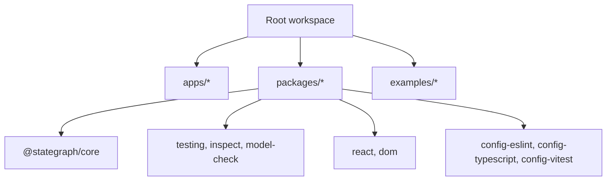

# Monorepo Foundation Design

## Overview

The monorepo foundation creates the shared execution environment for all StateGraph TS packages. It follows `TECHNICAL_REQUIREMENTS.md`, ADR-007, ADR-008, and `.kiro/steering/package-boundaries.md`.

## Architecture



## Workspace Layout

Create the workspace shape required by the TRD:

```txt
apps/
  docs/
  playground/
  devtools/
packages/
  core/
  testing/
  inspect/
  model-check/
  react/
  dom/
  vue/
  angular/
  solid/
  svelte/
  scxml/
  migrate-xstate/
  config-eslint/
  config-typescript/
  config-vitest/
examples/
  react-modal/
  react-form/
  dom-player/
```

MVP packages are published-ready. Post-MVP packages exist only as private stubs if scaffolded.

## Build and Package Policy

All published MVP packages use tsup with:

- `format: ['esm', 'cjs']`
- `dts: true`
- `sourcemap: true`
- `treeshake: true`
- `clean: true`

Package manifests use `"type": "module"` and CJS output with `.cjs`. Export maps must expose both import and require entries.

## Dependency Rules

`@stategraph/core` is dependency-light and framework-free. Tooling packages may depend on core. Adapter packages may depend on core plus their peer framework. Apps may depend on packages. Packages must not import from apps or deep-import private paths.

## Error Handling

Boundary violations should be caught through ESLint/import rules and package dependency hygiene. Missing build metadata should fail package export validation in CI.

## Testing Strategy

Foundation validation should include:

- package manager install;
- `format:check`;
- `lint`;
- `check-types`;
- `test`;
- `build`;
- package export validation.
