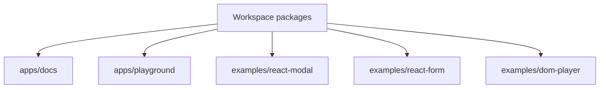

# Playground and Docs Design

## Overview

The playground and docs make StateGraph usable and validate public examples. They are Vite apps that consume workspace packages through public exports.

## Apps and Examples

## Playground Scope

The playground should include a React form/modal demo and a vanilla DOM player demo. It is for manual validation and should remain lightweight.

## Docs Scope

Initial docs should cover:

- package overview;
- runtime execution model;
- machine definition guide;
- effects guide;
- snapshots and selectors guide;
- adapter authoring and usage guide;
- testing and model-checking guide;
- trace and replay guide;
- migration guide from common XState concepts;
- contribution guide;
- package boundary rules.

## Migration Guide

The guide maps concepts without promising drop-in compatibility. It should emphasize `setup()`, serializable DSL, `assign`, explicit effects, actor snapshots, and React hook differences.

## Testing Strategy

CI builds docs, playground, and examples. Examples should be small but complete enough to catch public API drift.
