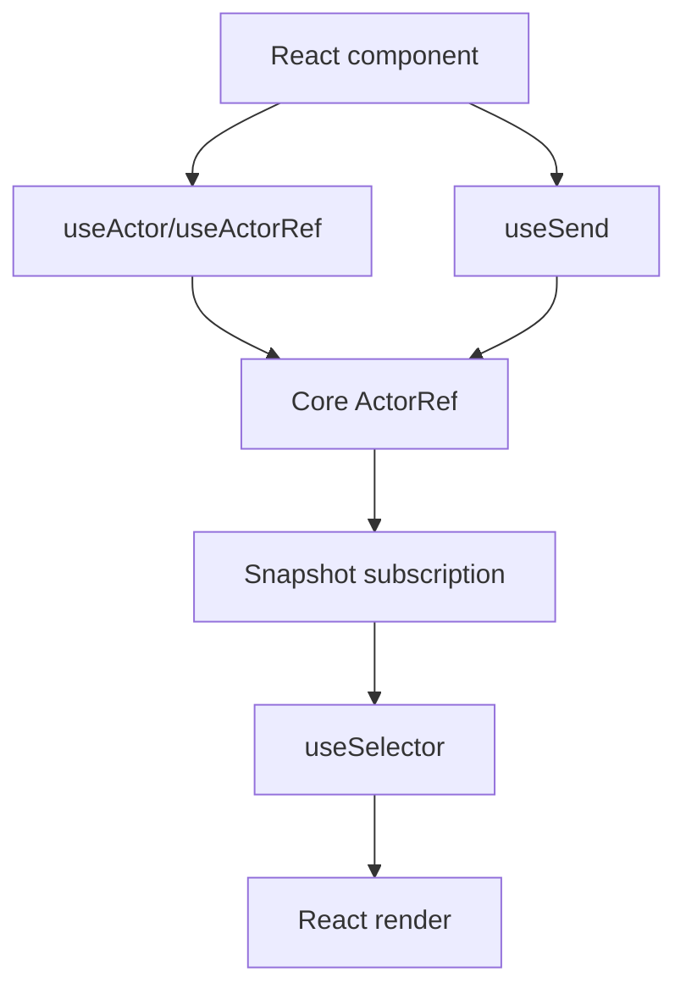

# React Adapter Design

## Overview

`@stategraph/react` wraps the core actor contract with React 18+ hooks. It follows ADR-009 and must not alter runtime semantics.

## Public API

```ts
useActor(machine, options?)
useActorRef(machine, options?)
useSelector(actor, selector, compare?)
useSend(actor)
StateGraphProvider
useActorContext()
```

## Hook Behavior



`useActor` owns lifecycle and subscribes to snapshots. `useActorRef` owns lifecycle but does not subscribe. `useSelector` subscribes to a selected value and compares with `Object.is` by default. `useSend` returns a stable send callback.

## Implementation Notes

Use React subscription primitives suitable for concurrent rendering. Do not run effects in React hooks except through actor start/stop. Cleanup must unsubscribe and stop adapter-owned actors.

## Error Handling

`useActorContext()` throws when no provider is present. Runtime errors remain core runtime errors and should be surfaced through snapshot/error or thrown paths defined by core behavior.

## Testing Strategy

Use React test utilities plus the shared adapter conformance suite from `@stategraph/testing`. Tests requiring DOM APIs use `jsdom` or `happy-dom`.
