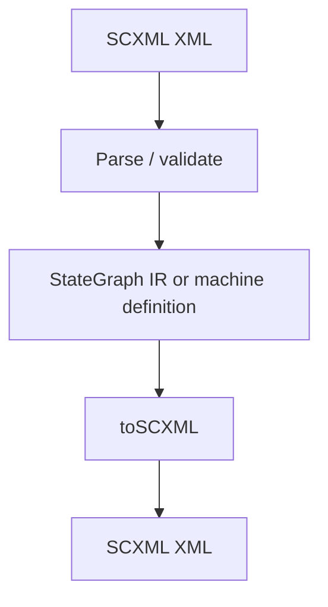

# SCXML Interoperability Design

## Overview

`@stategraph/scxml` provides optional conversion between SCXML and StateGraph machine structures. It is a compatibility layer, not a runtime adapter.

## Public API

```ts
fromSCXML(xml)
toSCXML(machine)
```

## Data Flow



Supported constructs should preserve hierarchy, parallel regions, history, transitions, and metadata. Unsupported constructs should produce explicit diagnostics.

## Implementation Notes

Keep this package isolated from core runtime semantics. Conversion code should operate on serializable machine structures and not depend on browser or adapter APIs.

## Testing Strategy

Use fixture-based import/export tests and unsupported-construct cases. Round-trip tests should focus on the supported subset rather than trying to guarantee full SCXML parity.
