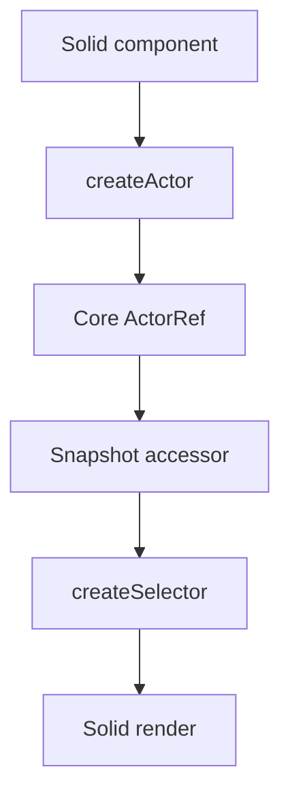

# Solid Adapter Design

## Overview

`@stategraph/solid` wraps the core actor contract with SolidJS primitives. It follows ADR-009 and must not alter runtime semantics.

## Public API

```ts
createActor(machine, options?)
createSelector(actor, selector)
```

## Hook Behavior



`createActor` owns lifecycle and returns a snapshot accessor, send function, and actor ref. `createSelector` returns a derived accessor that stays stable when the selected value does not change.

## Implementation Notes

Use Solid lifecycle cleanup primitives and avoid side effects outside actor start/stop. Keep actor sharing optional and based on Solid context when the app needs one actor across a subtree.

## Testing Strategy

Use Solid test utilities plus the shared adapter conformance suite from `@stategraph/testing`. Tests requiring DOM APIs should use a browser-like environment when needed.
