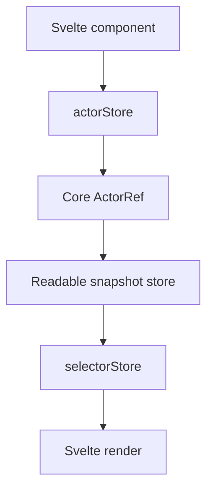

# Svelte Adapter Design

## Overview

`@stategraph/svelte` wraps the core actor contract with Svelte readable stores. It follows ADR-009 and must not alter runtime semantics.

## Public API

```ts
actorStore(machine, options?)
selectorStore(actor, selector)
```

## Hook Behavior



`actorStore` owns lifecycle and exposes a snapshot store plus `send` and actor ref. `selectorStore` exposes a derived readable store and compares selected values before notifying subscribers.

## Implementation Notes

Use Svelte lifecycle hooks and readable store semantics to start and stop actors. Keep actor sharing optional and based on Svelte context when an app needs one actor across a subtree.

## Testing Strategy

Use Svelte test utilities plus the shared adapter conformance suite from `@stategraph/testing`. Tests requiring DOM APIs should use a browser-like environment when needed.
