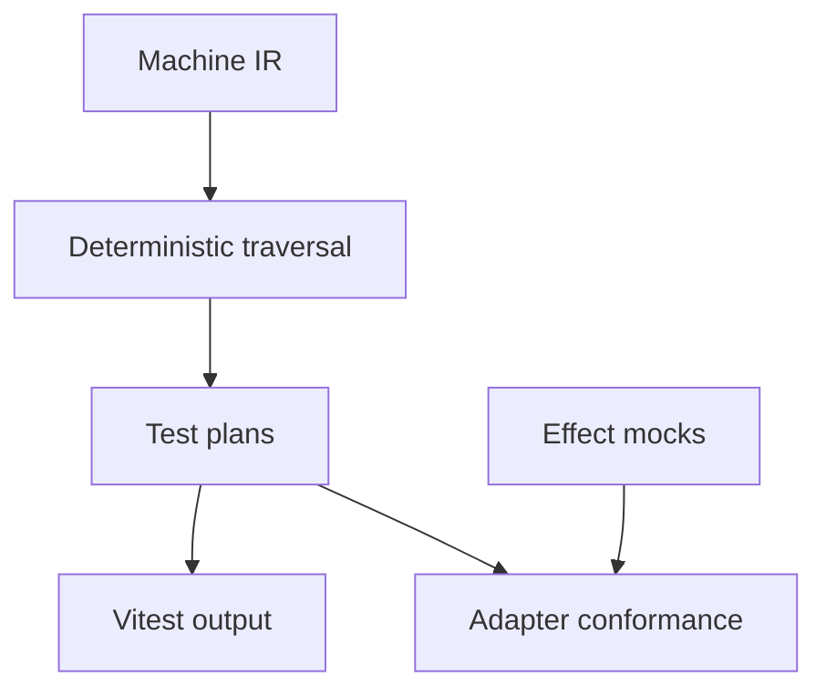

# Testing Package Design

## Overview

`@stategraph/testing` consumes public machine IR and actor contracts. It must not deep-import core internals. It provides deterministic test generation and shared adapter conformance helpers.

## Public API

```ts
getStateCoveragePlans(machineOrIr, options?)
getTransitionCoveragePlans(machineOrIr, options?)
getPathCoveragePlans(machineOrIr, options?)
getInvalidEventPlans(machineOrIr, options?)
getGuardBranchPlans(machineOrIr, options?)
emitVitestTests(plans, options?)
createPromiseEffectMock()
createCallbackEffectMock()
createAdapterConformanceSuite(adapter)
```

## Data Flow



## Generated Test Shape

Generated tests should be readable and deterministic. They should use public APIs, actor `send`, snapshots, pending effects, and `provide` overrides. They must not inspect internal queues or private registries.

## Adapter Harness

The conformance suite accepts adapter binding functions so each framework can mount and unmount idiomatically while the suite verifies shared behavior.

## Testing Strategy

Tests for this package use fixture machines covering simple finite states, hierarchy, parallel regions, guards, effects, invalid events, and adapter lifecycle behavior.
