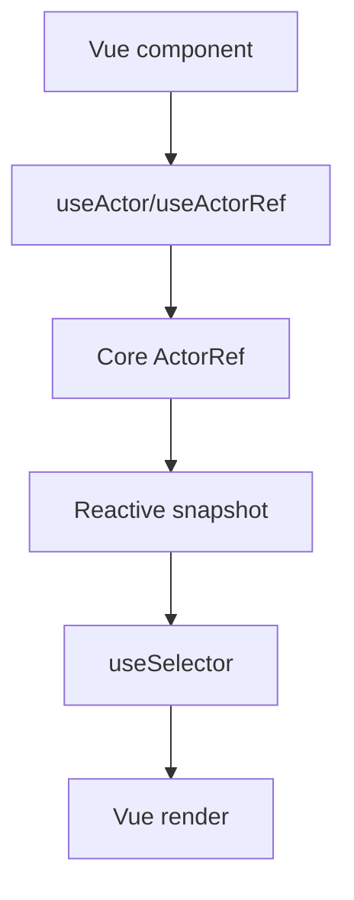

# Vue Adapter Design

## Overview

`@stategraph/vue` wraps the core actor contract with Vue 3 composables. It follows ADR-009 and must not alter runtime semantics.

## Public API

```ts
useActor(machine, options?)
useActorRef(machine, options?)
useSelector(actor, selector, compare?)
```

## Hook Behavior



`useActor` owns lifecycle and exposes a reactive snapshot handle plus `send`. `useActorRef` returns a stable actor ref without forcing rerenders from snapshot changes. `useSelector` returns a computed value derived from the actor snapshot and compares with `Object.is` by default.

## Implementation Notes

Use Vue 3 composition API primitives and lifecycle hooks to start and stop actors. Keep actor ownership local to the component unless the subtree deliberately shares a single actor through framework-native provide/inject behavior.

## Error Handling

Errors must surface through the core actor contract or Vue idiomatic throws; the adapter must not reinterpret transitions or effects.

## Testing Strategy

Use Vue test utilities plus the shared adapter conformance suite from `@stategraph/testing`. Tests requiring DOM APIs should use a browser-like environment such as `happy-dom`.
