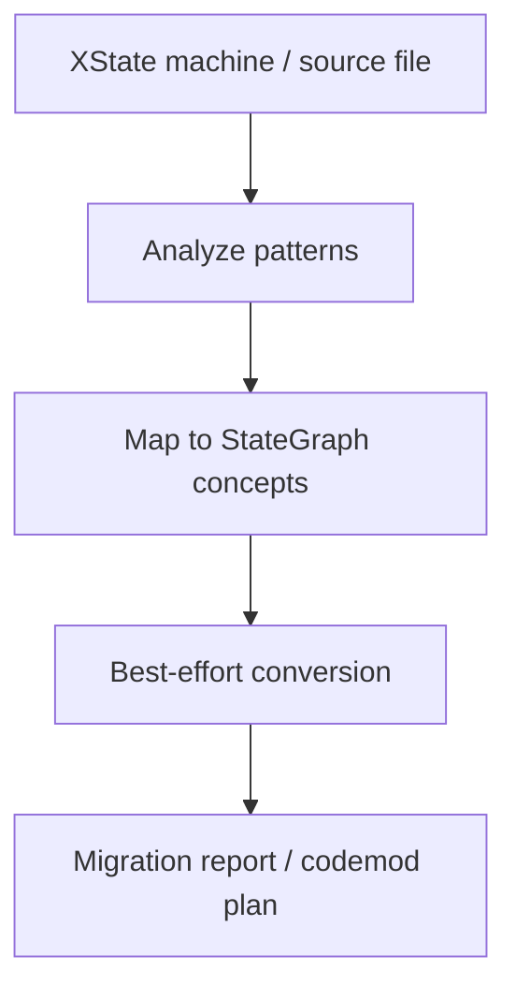

# XState Migration Design

## Overview

`@stategraph/migrate-xstate` provides best-effort analysis and conversion tools for moving common XState patterns to StateGraph TS. It is a migration aid, not a semantic compatibility promise.

## Public API

```ts
analyzeXState(input)
migrateXState(input)
createMigrationReport(result)
createCodemodPlan(source)
```

## Data Flow



The package should recognize common authoring patterns, convert safe cases to StateGraph object DSL, and report any unsupported constructs clearly. It should not promise a drop-in match for XState runtime behavior.

## Implementation Notes

Prefer deterministic analysis and source transforms. Keep the migration layer isolated from core runtime semantics and from adapter-specific APIs.

## Testing Strategy

Use fixture-based regression tests for common XState patterns, unsupported constructs, and report generation. Include source transform snapshots where codemods are implemented.
