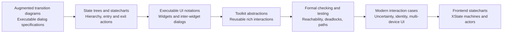
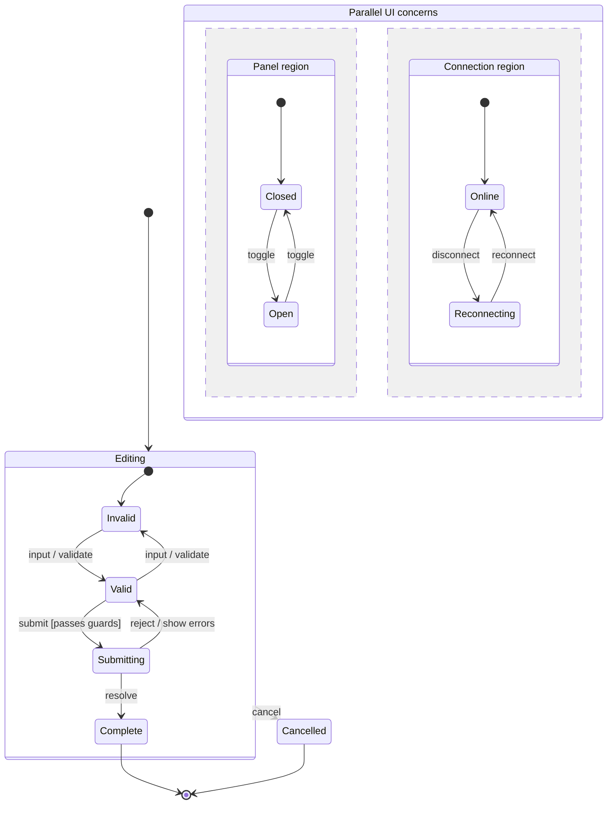
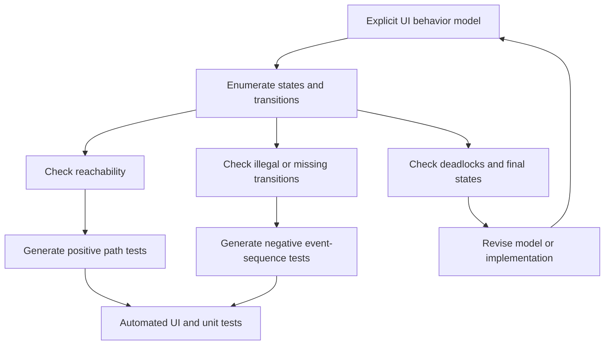
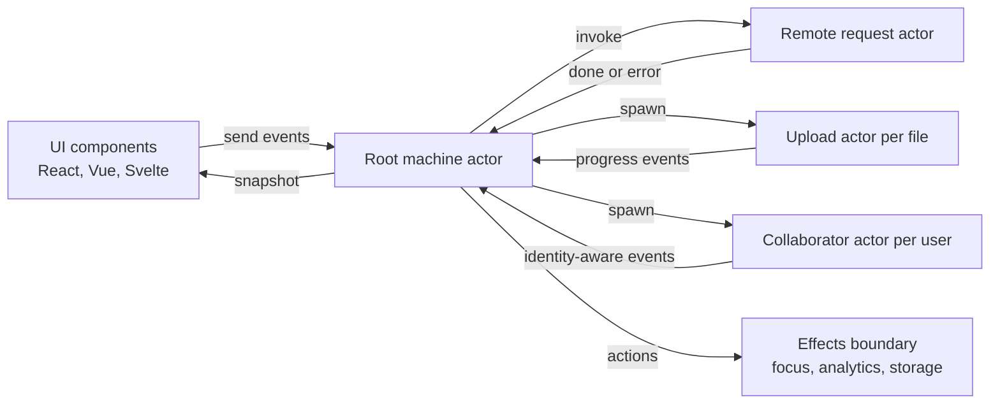

# State Machines in Human-Computer Interaction and Modern User Interface State Management

## Abstract

State machines have been used in human-computer interaction (HCI) for more than four decades as a way to make interaction behavior explicit, analyzable, executable, and reusable. Across the reviewed literature, a consistent argument emerges: graphical user interfaces are not merely arrangements of visual elements, but reactive systems whose behavior depends on event history, mode, task progress, input uncertainty, user identity, and relationships among interface components. Early finite state transition diagrams gave HCI researchers a compact notation for dialogs, but practical user interfaces quickly exposed the limits of flat automata. Later work introduced augmented transition diagrams, hierarchical state trees, statecharts, interaction object graphs, visual event grammars, and toolkit-level state-machine abstractions. These models address recurring UI problems: callback scattering, mode errors, state explosion, multi-device presentation, uncertain input, multi-user interaction, and systematic testing.

This paper synthesizes that research tradition and relates it to modern frontend state management, with particular attention to XState and statechart-based application design. The central claim is that contemporary web applications rediscover many problems already studied in HCI: asynchronous events, disabled or unavailable actions, overlapping modes, transitions with side effects, validation flows, remote data loading, animation state, and user feedback. Statechart libraries such as XState operationalize older HCI lessons by providing hierarchical states, guarded transitions, actions, invoked or spawned actors, parallel regions, history states, pure transition functions, visual tooling, and typed event contracts. The result is not a replacement for all state management, but a disciplined modeling layer for behavior whose legality depends on state and event sequence.

## 1. Introduction

Interactive software is reactive: it receives events, interprets them in context, changes state, performs effects, and presents feedback. This makes user interface programming different from straight-line computation. A button click, keystroke, drag gesture, timeout, network response, or speech-recognition hypothesis does not have a fixed meaning independent of the current interaction context. The same click may select an object, complete a drag, dismiss a menu, confirm a destructive action, or be ignored. For this reason, HCI research has repeatedly returned to state-machine models as a way to represent the dialog between user and system.

The HCI literature shows this progression clearly. Wasserman's work on augmented state transition diagrams framed formal, executable descriptions of computer-human interaction as part of a user software engineering methodology (Wasserman, 1985). Rumbaugh's state trees introduced hierarchy and inheritance into finite state machines for user interfaces, treating a UI state as the context that determines how events are interpreted (Rumbaugh, 1984). Carr's interaction object graphs extended statecharts to widget-level specification and composition (Carr, 1994). Later work moved from notation to implementation: HsmTk and SwingStates integrated hierarchical or finite state machines into practical toolkits for rich interaction programming (Blanch and Beaudouin-Lafon, 2006; Appert and Beaudouin-Lafon, 2008), while NVIDIA's SCXML-based UI tooling connected statecharts to production automotive interfaces (Kistner and Nuernberger, 2010s).

The relevance of this research has increased rather than diminished. Modern frontend applications combine local UI state, remote data state, animations, validation, optimistic updates, long-running tasks, concurrent views, and collaborative contexts. Many application states are not simply values in a store; they are modes with rules about what events are valid, what effects should run, and what feedback should appear. Nguyen's thesis on statecharts for modern web application state management makes this connection explicit: centralized state stores help organize data, but without explicit transition models, state management can remain ad hoc as complexity grows (Nguyen, 2020).

Modern libraries such as XState embody this lineage. In XState, a machine defines finite states and transitions; a running machine is an actor that receives events, emits snapshots, and can invoke or spawn other actors. The current XState documentation describes machines as models of behavior, including finite states, events, context, guards, actions, delays, parent and parallel states, final states, history states, and actors (Stately, 2026a; Stately, 2026b; Stately, 2026c). These concepts map closely to decades of HCI concerns: hierarchy combats duplication, parallel states combat state explosion, guards encode availability and preconditions, actions separate effects from transition structure, and actors represent independent interactive processes.

This paper asks three questions. First, what problems in HCI motivated state-machine models? Second, what use cases have prior papers considered? Third, how can those lessons guide modern frontend state management, especially in statechart libraries such as XState?

## 2. From Dialog Automata to Executable UI Specifications

Early state-machine approaches treated interaction as a dialog. A state captured where the user was in the conversation with the system, and transitions captured legal inputs. The attraction was direct: the model made it possible to see which commands were legal, which states were reachable, and how the system would respond to events. However, "pure" finite state machines were too weak for realistic UI specification. Wasserman's augmented transition diagrams added features needed by interactive information systems: output formatting, input processing, conditions, timing, and executable specification support (Wasserman, 1985). This was an important shift. The state-machine model was not only a diagram for documentation; it became a machine-processable artifact for prototyping and testing.

This executable orientation is central to the HCI tradition. A UI specification that cannot run may still be useful for discussion, but it can drift from implementation. An executable state model can be simulated, tested, reviewed by designers and developers, and used to expose missing cases. Carr's interaction object graphs follow the same principle. IOGs are graphical, executable specifications that extend statecharts to model widget behavior, relationships among widget attributes, inter-widget dialog states, and communication with application code (Carr, 1994). The model therefore spans both micro-interactions, such as widget state, and larger dialog flow.

Two lessons from this early work remain important for modern UI engineering. First, interaction logic should be explicit. When behavior is hidden inside event handlers, component lifecycle callbacks, animation callbacks, and scattered boolean flags, the actual dialog becomes difficult to inspect. Second, visual state and logical interaction state should not be conflated. A screen, slide, or component tree is not necessarily a state in the behavioral sense. The same visual screen may support different modes, and the same logical state may be presented differently across devices.

XState implements this executable-specification idea in a frontend form. A machine configuration is both documentation and behavior. Its transition function can be inspected, tested, visualized, and executed. XState's support for pure transition functions makes it possible to compute the next snapshot and actions from a current state and event without starting a full actor, which echoes the older ambition that state models should be analyzable artifacts rather than merely informal diagrams (Stately, 2026a).

## 3. Hierarchy, State Explosion, and Structured Interaction

Flat finite state machines do not scale well for complex user interfaces. If every combination of conditions must become a separate state, the model expands rapidly. HCI researchers addressed this by introducing hierarchy and shared behavior. Rumbaugh's state trees organize states into trees, allowing substates to inherit event traps, entry actions, exit actions, and attributes from superstates (Rumbaugh, 1984). This reduces duplication and lets designers restructure interfaces by moving subtrees as modules.

Hierarchy is especially natural for UI behavior. A media player may have a parent `playing` state with child states such as `buffering`, `normal`, and `seeking`. A form may have a parent `editing` state with child states `valid`, `invalid`, and `submitting`. A drawing tool may have a parent `dragging` state with substates for threshold detection, active drag, snapping, and drop confirmation. Parent states handle shared events such as cancel, escape, blur, or teardown; child states specialize behavior.

Statecharts, UML state machines, SCXML, and XState all preserve this insight. The XState documentation represents nested states as tree-like state values and supports parent states, parallel states, final states, and history states (Stately, 2026b). This matters in frontend applications because many UI workflows are nested: a checkout flow contains shipping, billing, payment, review, and confirmation; each step contains loading, validation, error, and editing behavior. Without hierarchy, designers and developers often encode the same rules repeatedly across components.

Parallel states address a related problem. Some parts of an interface are independent but simultaneous. A document editor may track tool mode, selection state, autosave status, collaboration connection, and sidebar visibility. Encoding every combination as a flat state is impractical. Orthogonal or parallel regions allow independent state machines to run within one model. NVIDIA's SCXML work emphasizes the utility of hierarchical and parallel states for UI simplicity and stability, especially in automotive interface prototyping and production (Kistner and Nuernberger, 2010s). Degani, Heymann, and Gellatly likewise use statecharts to model automotive climate-control behavior with concurrent components, guarded transitions, side effects, and automatic/manual modes (Degani et al., 2011).

The practical frontend lesson is that not every piece of state belongs in one global store variable, nor should every combination be represented manually. Hierarchical and parallel statecharts let developers encode structure that matches interaction semantics. This is particularly useful when a user-facing mode has submodes, when independent regions must be coordinated, or when leaving a parent state should reliably clean up child behavior.

## 4. State Machines as Toolkit Abstractions

Several papers in the reviewed literature move beyond specification and show state machines as programming abstractions. HsmTk treats interactions as first-class reusable objects specified with hierarchical state machines and attached to structured graphics such as SVG elements (Blanch and Beaudouin-Lafon, 2006). This is significant because rich post-WIMP interactions do not fit neatly into traditional widget libraries. Dragging, lasso selection, manipulation handles, hover-sensitive controls, and compound gestures require stateful interpretation across many low-level events. By separating interaction behavior from visual structure, HsmTk allows designers to refine graphics while developers refine behavior.

SwingStates makes a similar argument in the Java/Swing ecosystem. Callback-based toolkits scatter behavior across listeners, which makes advanced interaction difficult to teach, reason about, maintain, and extend. SwingStates lets developers specify finite state machines directly in Java, redefine widget behavior, create new widgets on a canvas, and support arbitrary input devices (Appert and Beaudouin-Lafon, 2008). Its contribution is not that every UI can be made simpler by drawing a diagram, but that state machines can become an ordinary programming construct for interactive behavior.

This toolkit work anticipates modern frontend component problems. React, Vue, Svelte, and other UI frameworks make rendering declarative, but they do not automatically make behavior explicit. A React component may still distribute state across hooks, effects, reducers, callbacks, query libraries, refs, and DOM event handlers. XState and similar libraries can serve the same role that HsmTk and SwingStates served in earlier toolkits: they isolate interactive behavior into an explicit model that can be reused, inspected, tested, and attached to rendering code.

The actor model in XState extends this toolkit idea. A running machine is an actor; actors can receive events, process one message at a time, invoke child actors when entering states, and spawn actors dynamically (Stately, 2026c). For frontend systems, this is useful when components have independent lifecycles: a file upload actor per file, a form actor per modal instance, a notification actor per toast, or a collaborative cursor actor per remote user. The UI tree can subscribe to snapshots, while the actor owns the behavior.

## 5. Formal Analysis, Verification, and Testing

One of the strongest reasons to model UI behavior explicitly is that explicit models can be checked. Berstel, Crespi Reghizzi, Roussel, and San Pietro present Visual Event Grammars (VEG), a modular formal approach for specifying GUI dialog behavior independently of layout. Their pipeline supports verification with SPIN to detect consistency problems, deadlocks, unreachable states, and to generate test cases (Berstel et al., 2005). Belli similarly uses finite-state automata and regular expressions to model desired and undesired GUI behavior, then generate and select tests according to transition coverage (Belli, 2001).

This line of work is important because GUI testing is combinatorial. Users can often perform actions in many orders, including erroneous orders. The problem is not merely testing that each button works; it is testing that sequences of events are accepted, rejected, or handled correctly according to the interface's state. A state model gives testing a structure. Coverage can be defined over states, transitions, paths, guards, or known invalid sequences. Negative behavior can be modeled as deliberately as desired behavior.

Modern frontend development often uses unit tests, integration tests, and browser automation, but the same issue persists. If a checkout flow has states such as `cart`, `shipping`, `payment`, `submitting`, `failed`, and `confirmed`, then test cases should cover legal transitions, disabled transitions, recoveries, retry paths, and cancellation. State machines provide a natural source for such tests. XState snapshots can expose the current state value and context, `state.can(event)` can determine whether an event is currently accepted, and transition introspection can help generate available actions for debugging, documentation, and testing (Stately, 2026a; Stately, 2026b).

Formal verification is not necessary for every web form. However, the research suggests a spectrum. At one end, small interaction machines make code easier to reason about. In the middle, machines support systematic tests and visual review. At the high-assurance end, state models can feed model checkers or property-based test generation. Safety-critical HMI, healthcare applications, payments, identity flows, and destructive administration interfaces benefit most from moving along this spectrum.

## 6. Modes, Automation, and User Prediction

State machines are particularly valuable for modeling modes. A mode changes the meaning of future input. Modes are powerful but risky because users may not know which mode the system is in or what actions are possible. Automotive HMI research makes this risk concrete. Degani, Heymann, and Gellatly analyze climate-control systems using statecharts to expose automatic/manual modes, side effects, guarded transitions, lockouts, and design patterns (Degani et al., 2011). Hidden automation priorities can cause confusion because the system behaves according to internal state that is not visible or predictable to the driver.

The same problem appears in everyday interfaces. A command palette may be in search mode, command mode, or confirmation mode. A rich-text editor may be editing text, resizing media, dragging a block, composing with an input method editor, or showing autocomplete. A dashboard may be viewing, editing, filtering, exporting, or reconnecting. When modes are implicit, bugs and user confusion increase.

The reviewed HMI work suggests three design requirements for modal behavior. First, modes should be explicit in the model. Second, transitions into and out of modes should have visible feedback. Third, side effects should be attached deliberately to entry actions, exit actions, or transitions so that they can be reviewed. XState supports this by making states, transitions, entry and exit actions, guards, and delayed transitions part of the machine configuration. This does not guarantee good UX, but it gives teams a concrete object to inspect when asking whether the interface communicates its mode.

## 7. Uncertainty, Identity, and Multi-User Interaction

Traditional finite state machines assume that events are discrete and certain. Modern interfaces often violate that assumption. Touch input, gestures, speech recognition, sensor data, computer vision, and context-aware systems produce uncertain estimates. Schwarz, Mankoff, and Hudson address this with Monte Carlo methods for managing interactive state, action, and feedback under uncertainty (Schwarz et al., 2011). Their key move is to avoid collapsing uncertainty too early. The framework maintains samples over possible inputs, interactor states, and actions, while developers specify most behavior as ordinary deterministic interactors.

This work expands the state-machine idea. A UI may not have one known state; it may have a probability distribution over possible states. Feedback may need to represent ambiguity, and final actions may need arbitration. Although mainstream frontend statechart libraries such as XState do not directly provide probabilistic state distributions, the design lesson remains relevant. Developers should be careful about prematurely converting ambiguous input into a single event. In gesture-heavy, AI-assisted, voice, or sensor-driven interfaces, it may be useful to model recognition confidence, candidate states, confirmation flows, and fallback states explicitly.

Identity-aware interfaces add another dimension. Laurillau's IOWAState models address interactive surfaces where the system can differentiate users (Laurillau, 2013). In these systems, state is not only about what is happening, but who is acting. Events carry user identity; components may maintain one state machine per user or route events differently depending on identity. This is directly relevant to collaborative web applications, multiplayer editors, classroom tools, shared dashboards, and administrative systems with role-sensitive interaction.

XState's actor model provides a practical way to implement parts of this pattern. A collaborative interface can spawn an actor per participant, per cursor, per selection, or per permission-sensitive workflow. Events can include user identity, role, or session metadata, while guards enforce whether a transition is legal for that actor. This is not a substitute for backend authorization, but it is valuable for frontend behavior: available commands, optimistic updates, conflict states, and feedback can be modeled explicitly.

## 8. Task State, View State, and Multi-Device Interfaces

A recurring theme in the literature is the separation of task state from view state. Sauter, Vogler, Specht, and Flor extend MVC for pervasive multi-client user interfaces by distinguishing device-independent task state from device-specific view state, both modeled as finite state automata in XML (Sauter et al., 2004). This allows the same task flow to support different devices and even device changes during use.

This distinction is useful for modern responsive and multi-platform applications. A checkout task may be the same across desktop, mobile, kiosk, and embedded display, but the view flow differs. A desktop interface may show steps side by side; mobile may show one step per screen; an in-car interface may restrict input while driving. If task state is encoded inside a particular component tree, the logic becomes hard to reuse across presentations. If task state is modeled separately, views can subscribe to the task machine and render appropriate layouts.

XState machines can play this role. A machine can represent task progress, valid events, validation, loading, and completion, while React or another view layer renders different presentations based on snapshots. State metadata, tags, and selectors can help map logical state to UI affordances. This pattern echoes both the MVC extension and NVIDIA's concern with separating logical interaction state from presentation slides.

## 9. Mapping Research Concepts to XState and Modern Frontend Practice

The following mapping summarizes how older HCI concepts appear in modern statechart-based frontend libraries:

| HCI/state-machine concept | Research motivation | XState/frontend expression |
| --- | --- | --- |
| Explicit interaction state | Avoid hidden dialog logic and callback scattering | Machine states, state values, snapshots |
| Events | Model user/system occurrences in context | Typed event objects sent to actors |
| Guards and conditions | Represent legal actions and preconditions | Guarded transitions and `state.can(event)` |
| Entry/exit/transition actions | Synchronize feedback, effects, and cleanup | Actions, `entry`, `exit`, `assign`, `sendTo`, `raise` |
| Hierarchy | Share behavior and reduce duplication | Parent and nested states |
| Parallelism | Avoid Cartesian explosion of independent modes | Parallel state nodes and actor systems |
| Executable specification | Prototype, simulate, and test the model | Machine config, interpreter, visual tools |
| Formal checking/testing | Detect deadlocks, unreachable states, invalid paths | Transition tests, model-based tests, introspection |
| Task/view separation | Support multi-device and presentation-independent flows | Machines as task logic, components as views |
| Identity-aware interaction | Route behavior by user identity | Events with identity, actors per user/session |
| Uncertain interaction | Preserve ambiguity in input interpretation | Confidence states, candidate events, confirmation actors |

This mapping clarifies what XState is best suited for. It is strongest when the application contains a meaningful protocol: a workflow, lifecycle, modal interaction, async process, wizard, editor mode, upload pipeline, authentication flow, checkout, onboarding sequence, or collaborative object. It is less necessary for simple derived data, purely presentational toggles, or local values that have no interesting transition rules.

## 10. Design Guidelines for Using State Machines in Frontend UI

The surveyed work supports several practical guidelines.

First, model behavior, not pixels. A state should represent what the system is ready to do or how it will interpret events, not merely which screen is visible. Visual states can be derived from logical states, but they should not replace them.

Second, start with events. A useful state machine begins by naming events that matter: submit, cancel, retry, timeout, blur, validation success, validation failure, upload progress, server conflict, permission change, connection lost. Good event names expose the domain protocol.

Third, use hierarchy when events are shared. If several substates respond to cancel, escape, timeout, or permission revocation in the same way, they probably belong under a parent state.

Fourth, use parallel states for independent concerns. Loading state, selection state, connection state, and panel visibility should not be forced into one flat enumeration if they evolve independently.

Fifth, keep effects at the boundary. Transition structure should stay readable. Network calls, storage writes, analytics, focus management, and imperative view effects should be named actions or actors rather than hidden inside arbitrary callbacks.

Sixth, test from the model. Tests should cover allowed transitions, rejected transitions, recovery paths, and final states. For important flows, generate tests from the machine or at least use the machine as the test outline.

Seventh, model error and cancellation states deliberately. Many UI bugs come from treating failure, retry, abort, stale response, and cleanup as afterthoughts. State machines make these cases visible.

Eighth, use actors for lifecycles. If something can start, receive events, emit snapshots, and stop independently, it is a candidate actor: uploads, sockets, modal flows, background jobs, timers, and per-user collaborative objects.

Ninth, expose modes to users. If the model contains a mode, the UI should communicate it through affordances, disabled actions, labels, focus, cursor, animation, or layout.

Tenth, do not over-model. A state machine should clarify behavior. If the model becomes a verbose mirror of simple mutable data, the abstraction is being used in the wrong place.

## 11. Limitations and Open Problems

State machines do not solve every UI state problem. They can become large, and large machines require naming discipline, modularization, visualization, and tests. Extended state, often called context, can also reintroduce hidden complexity if developers place too much logic in arbitrary variables rather than finite states. A machine with one state and many flags is often just an object store with extra syntax.

There is also a modeling cost. Teams must learn to distinguish finite control state from data state, events from commands, guards from validation, and actions from state transitions. Tooling helps, but the conceptual shift matters. The HCI literature shows that state-machine approaches succeed when they are integrated into design and implementation workflows, not when they are added as diagrams after coding is complete.

Finally, modern AI-assisted and probabilistic interfaces challenge deterministic statecharts. The Monte Carlo work surveyed above suggests one path: retain deterministic interaction descriptions where possible, but manage distributions over inputs and states when uncertainty is inherent. Future frontend state libraries may need stronger patterns for probabilistic events, intent recognition, human approval, and adaptive UI generation.

## 12. Conclusion

The use of state machines in HCI is not a historical curiosity; it is a continuing response to the structure of interactive software. User interfaces are event-driven systems whose behavior depends on context, sequence, mode, identity, uncertainty, and side effects. The research literature shows a progression from augmented transition diagrams and state trees to executable widget specifications, hierarchical state-machine toolkits, SCXML production workflows, formal verification, GUI test generation, uncertain-input models, identity-aware interfaces, and task/view separation for pervasive UIs.

Modern frontend statechart libraries such as XState inherit and operationalize these ideas. They give developers a way to model UI behavior as explicit states, events, transitions, guards, actions, actors, hierarchy, and parallel regions. Used well, they reduce callback scattering, clarify modes, improve testability, separate task logic from presentation, and support complex asynchronous workflows. Their main value is not that every value becomes a state, but that interaction protocols become visible and executable. The enduring lesson from HCI research is that when a UI has rules about what can happen next, those rules deserve a model.

## References

Appert, C., and Beaudouin-Lafon, M. (2008). *SwingStates: Adding state machines to Java and the Swing toolkit*. Software: Practice and Experience, 38(11), 1149-1182. https://doi.org/10.1002/spe.867

Belli, F. (2001). *Finite State Testing and Analysis of Graphical User Interfaces*. Proceedings of the International Symposium on Software Reliability Engineering.

Berstel, J., Crespi Reghizzi, S., Roussel, G., and San Pietro, P. (2005). *A Scalable Formal Method for Design and Automatic Checking of User Interfaces*. ACM Transactions on Software Engineering and Methodology, 14(2), 124-167. https://doi.org/10.1145/1061254.1061256

Blanch, R., and Beaudouin-Lafon, M. (2006). *Programming Rich Interactions using the Hierarchical State Machine Toolkit*. Proceedings of the Working Conference on Advanced Visual Interfaces. https://doi.org/10.1145/1133265.1133275

Carr, D. A. (1994). *Interaction Object Graphs: An Executable Graphical Notation for Specifying User Interfaces*. In P. Palanque and F. Paterno (Eds.), *Formal Methods in Human-Computer Interaction*.

Chin, B., and Millstein, T. (2008). *An Extensible State Machine Pattern for Interactive Applications*. ECOOP 2008: Object-Oriented Programming.

Degani, A., Heymann, M., and Gellatly, A. (2011). *HMI Aspects of Automotive Climate Control Systems*. IEEE International Conference on Systems, Man, and Cybernetics.

Kistner, G., and Nuernberger, C. (n.d.). *Developing User Interfaces using SCXML Statecharts*.

Laurillau, Y. (2013). *IOWAState: Models and Design Patterns for Identity-Aware User Interfaces Based on State Machines*. Proceedings of the ACM International Conference on Interactive Tabletops and Surfaces. https://doi.org/10.1145/2494603.2480299

Nguyen, T. (2020). *Statecharts for modern web application state management*. Bachelor thesis, Metropolia University of Applied Sciences.

Rumbaugh, J. (1984). *State Trees as Structured Finite State Machines for User Interfaces*. Proceedings of the ACM SIGSOFT/SIGPLAN Software Engineering Symposium on Practical Software Development Environments. https://doi.org/10.1145/62402.62404

Sauter, P., Vogler, G., Specht, G., and Flor, T. (2004). *A Model-View-Controller extension for pervasive multi-client user interfaces*. Personal and Ubiquitous Computing, 9, 100-107. https://doi.org/10.1007/s00779-004-0314-7

Schwarz, J., Mankoff, J., and Hudson, S. E. (2011). *Monte Carlo Methods for Managing Interactive State, Action and Feedback Under Uncertainty*. Proceedings of the ACM Symposium on User Interface Software and Technology. https://doi.org/10.1145/2047196.2047227

Stately. (2026a). *XState documentation: State machines*. Accessed June 28, 2026. https://stately.ai/docs/machines

Stately. (2026b). *XState documentation: State*. Accessed June 28, 2026. https://stately.ai/docs/states

Stately. (2026c). *XState documentation: Actors*. Accessed June 28, 2026. https://stately.ai/docs/actors

Wasserman, A. I. (1985). *Extending State Transition Diagrams for the Specification of Human-Computer Interaction*. IEEE Transactions on Software Engineering, SE-11(8), 699-713.
