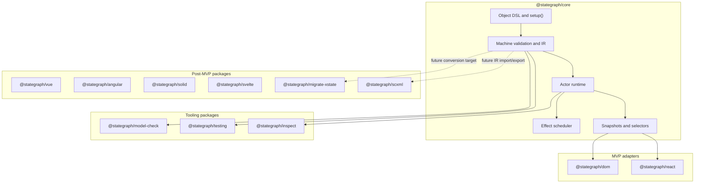
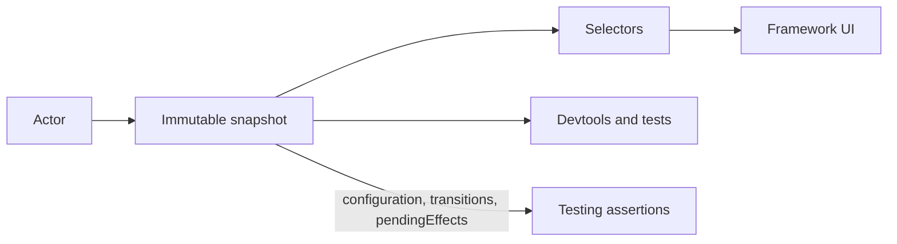
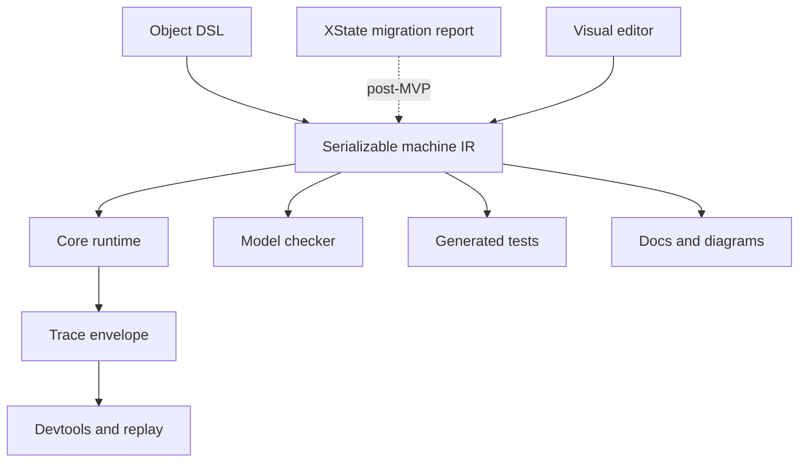
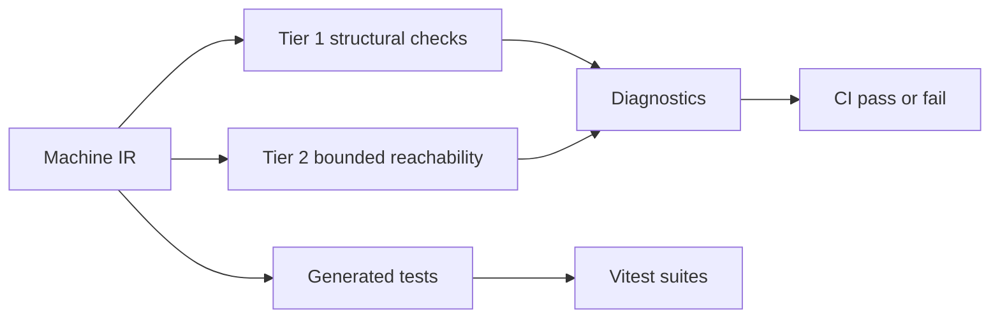
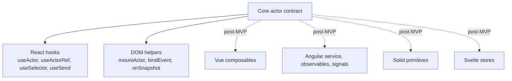

# StateGraph TS: Reference Architecture and White Paper

## Executive Summary

StateGraph TS is a TypeScript-first platform for explicit, deterministic, inspectable interaction state. It combines a framework-independent statechart runtime, strongly typed state-management primitives, actor-based execution, traceable effects, generated tests, model checking, devtools, and framework adapters behind one stable semantic core.

The platform is motivated by a recurring problem in modern application development: UI behavior is often spread across component state, reducers, callbacks, effects, query libraries, refs, timers, subscriptions, and framework lifecycle hooks. That distribution makes interaction logic difficult to inspect, replay, test, migrate, or verify. StateGraph addresses this by treating behavior as a model: states, events, transitions, guards, actions, effects, actors, snapshots, and protocols are explicit runtime and tooling artifacts.

StateGraph is positioned as a migration-friendly alternative to XState and ad hoc state stores, but it does not promise drop-in XState compatibility. Its reference architecture centers on one deterministic runtime, a serializable machine intermediate representation (IR), thin framework adapters, and tooling packages that consume public contracts rather than private runtime internals.

## Product Thesis

Modern UI complexity is not only data complexity. It is protocol complexity. A user flow has rules about what can happen next, which events are valid, what should be disabled, which side effects should run, how errors recover, and what feedback the user should see. Traditional state stores represent values well, but often leave transition legality and effect lifecycles implicit.

StateGraph's thesis is that application behavior should be modeled as a graph that is:

- explicit enough for engineers and designers to inspect;
- deterministic enough to replay and debug;
- typed enough for TypeScript teams to trust;
- serializable enough for devtools, visual editors, migration tools, and model checkers;
- framework-neutral enough that React, Vue, Angular, Solid, Svelte, DOM, and server runtimes share the same semantics;
- practical enough to use for everyday forms, modals, dashboards, editors, onboarding, checkout, and collaborative UI.

The product requirements define StateGraph as a platform that brings statecharts and state management into one coherent model. The technical requirements narrow that vision into a Turborepo monorepo with a small dependency-light core, official adapters, testing and inspection packages, model-checking utilities, and migration support.

## Architectural Overview

StateGraph is organized around a small core runtime and a set of tooling and adapter packages. The runtime owns semantics. Tooling packages consume the runtime's public graph, snapshot, actor, and trace contracts. Framework adapters translate actor snapshots and event dispatch into idiomatic framework APIs without changing behavior.



The MVP publishes six stable `0.x.y` packages:

- `@stategraph/core`
- `@stategraph/react`
- `@stategraph/dom`
- `@stategraph/testing`
- `@stategraph/inspect`
- `@stategraph/model-check`

The Vue, Angular, Solid, Svelte, SCXML, and XState migration packages may live as private stubs in the monorepo, but they are not published as stable packages during MVP.

## Core Runtime

The core runtime is the semantic center of StateGraph. It must not depend on framework adapters, browser globals, app code, DOM APIs, test frameworks, or visualization packages. Its responsibilities are:

- machine definition types and validation;
- statechart execution;
- actor lifecycle;
- event queueing;
- transition selection;
- guard evaluation;
- action execution;
- effect request scheduling;
- context updates;
- snapshot creation;
- selector subscriptions;
- trace emission;
- graph IR export.

The required public capabilities are:

```ts
createMachine(definition)
createActor(machine, options?)
actor.start()
actor.stop()
actor.send(event)
actor.getSnapshot()
actor.subscribe(listener)
actor.select(selector, listener)
actor.inspect(listener)
```

Exact public names may evolve during API design, but the capabilities are architectural requirements.

### Deterministic Execution

StateGraph uses run-to-completion semantics. One external event is processed at a time. All selected transitions, exit actions, transition actions, context assignments, entry actions, internal events, and effect requests for that step complete before subscribers observe the next stable snapshot.

```mermaid
sequenceDiagram
    participant UI as UI or caller
    participant Actor as StateGraph actor
    participant Queue as Event queue
    participant Runtime as Runtime step
    participant Effects as Effect system
    participant Subs as Subscribers

    UI->>Actor: send(event)
    Actor->>Queue: enqueue external event
    Queue->>Runtime: dequeue next event
    Runtime->>Runtime: evaluate guards and select transitions
    Runtime->>Runtime: run exit, transition, and entry actions
    Runtime->>Runtime: apply assign() context updates
    Runtime->>Effects: schedule explicit effects
    Runtime->>Actor: commit snapshot
    Actor->>Subs: notify consistent snapshot
```

Given the same machine, initial context, event sequence, and effect results, the actor must produce the same snapshot sequence. Stable ordering is required for external events, internal events, transition priority, action ordering, parallel region updates, and effect request emission.

### Statechart Semantics

The v1 runtime supports:

- atomic states;
- compound and hierarchical states;
- parallel states;
- initial and final states;
- shallow and deep history;
- guarded transitions;
- targetless transitions;
- self transitions;
- entry, exit, and transition actions;
- delayed events;
- invoked effects;
- child actors.

Context exists for extended state, but it must not replace explicit control state. StateGraph documentation should discourage boolean-mode sprawl where finite states would better describe the protocol.

## Authoring Model

StateGraph's primary authoring surface is a serializable object DSL wrapped by `setup()` for type capture. This follows ADR-001 and ADR-002.

```ts
const machine = setup({
  guards: {
    isValid: ({ context }) => context.value.length > 0,
  },
  actions: {
    setError: assign(({ event }) => ({ error: event.message })),
    clearError: assign(() => ({ error: null })),
  },
  effects: {
    submitForm: fromPromise(({ input, signal }) =>
      fetch(input.url, { signal }).then((response) => response.json())
    ),
  },
}).createMachine({
  id: 'form',
  initial: 'idle',
  context: { value: '', error: null },
  states: {
    idle: {
      on: {
        SUBMIT: { target: 'submitting', guard: 'isValid' },
      },
    },
    submitting: {
      entry: ['clearError'],
      invoke: {
        src: 'submitForm',
        input: ({ context }) => ({ url: '/api/submit' }),
        onDone: 'success',
        onError: { target: 'idle', actions: ['setError'] },
      },
    },
    success: { type: 'final' },
  },
})
```

The object DSL is the primary stable API. A full programmatic builder is post-MVP and must be marked experimental if introduced. Bare `createMachine(definition)` remains available for untyped usage and migration targets.

### Serializability

Machine definitions must round-trip through JSON without losing semantics. Guards, actions, and effects are referenced by string names in the DSL and implemented in `setup()` or actor-level `provide` overrides. Inline functions in serialized definitions are not allowed because they would break devtools, model checking, visual editing, trace replay, and safe import from external sources.

### Actions and Effects

Actions are synchronous, traceable operations. Context updates happen only through `assign()`. Plain side-effect actions return `void` and are registered by name.

Effects represent asynchronous or external work. They are requested by the runtime rather than executed invisibly inside transition code. MVP effect creators are:

- `fromPromise()` for one-shot async work with `AbortSignal` cancellation;
- `fromCallback()` for subscriptions, event emitters, sockets, and callback-style integrations;
- `fromObservable()` as a type stub only in MVP.

Implementations can be overridden at actor creation time:

```ts
createActor(machine, {
  provide: {
    guards: { isValid: () => true },
    actions: { toast: () => {} },
    effects: {
      submitForm: fromPromise(async () => ({ ok: true })),
    },
  },
})
```

This gives tests and dependency injection a first-class path without requiring a separate mocking framework.

## Actor and Snapshot Model

A machine is a definition. An actor is a running instance of a machine. Actors own the current snapshot, context, event queue, subscriptions, effect lifecycle, child actors, and trace history when inspection is enabled.

Snapshots are immutable descriptions of actor state after an event step. ADR-004 fixes the snapshot contract around:

- `status`;
- `value`;
- `configuration`;
- `context`;
- `changed`;
- `event`;
- `transitions`;
- `pendingEffects`;
- `children`;
- `error`;
- `_traceId`.

The `value` field preserves the statechart mental model and eases XState migration. The `configuration` field provides a flat set of active state node IDs for selectors, devtools, and tooling. The `changed` flag lets adapters avoid unnecessary re-renders without duplicating diff logic in each framework package.



## Intermediate Representation

Every machine must be convertible to a serializable graph IR. The IR is the shared contract between authoring, runtime, tooling, migration, visual editing, and analysis.

The IR includes:

- machine metadata;
- state node IDs;
- state hierarchy;
- parallel region metadata;
- initial, final, and history nodes;
- transitions;
- event names;
- guard references;
- action references;
- effect references;
- protocol contracts;
- source locations when available;
- visual layout metadata when provided by tools.

Tooling must consume the public IR rather than private runtime internals. This keeps the runtime small while enabling model checking, generated tests, visual editors, devtools, and migration reports to evolve around stable contracts.



## Trace, Inspection, and Replay

Inspection is a platform feature, not a debugging afterthought. The runtime emits trace events; `@stategraph/inspect` owns their schema, validation, serialization, import/export, and transport protocols.

ADR-005 defines a versioned trace envelope:

```ts
interface TraceEnvelope {
  schemaVersion: string
  sessionId: string
  machineId: string
  actorId: string
  createdAt: number
  events: TraceEvent[]
}
```

Trace events use the reserved `@namespace.verb` convention, such as:

- `@actor.started`;
- `@event.received`;
- `@transition.fired`;
- `@action.executed`;
- `@effect.started`;
- `@effect.done`;
- `@effect.error`;
- `@effect.cancelled`;
- `@context.updated`;
- `@error`.

Devtools and replay must parse trace envelopes through versioned schemas before use. This prevents older tools from silently misreading newer traces.

## Testing and Model Checking

StateGraph treats testing and model checking as default platform capabilities. The testing package consumes the machine graph and runtime contracts to generate deterministic, readable Vitest-compatible tests.

`@stategraph/testing` owns:

- state coverage generation;
- transition coverage generation;
- bounded path generation;
- invalid-event test generation;
- guard-branch test generation;
- effect mock scaffolding;
- adapter test harness helpers.

`@stategraph/model-check` owns structural and bounded analysis. ADR-006 defines two tiers:

- Tier 1: always-on structural graph analysis.
- Tier 2: opt-in bounded reachability over concrete or abstracted context.

Tier 1 checks include unreachable states, dead states, dead transitions, invalid targets, nondeterminism, and missing initial states. Effects without cancellation policy are a warning check and are off by default. Bounded analysis has explicit limits for path depth, explored states, transitions, cycle length, and timeout.



The model checker must be honest about limits. If bounded analysis hits a configured limit, the result reports `hitLimit: true` rather than implying full proof.

## Adapter Architecture

Adapters provide idiomatic framework integration while preserving core semantics. They consume the same actor contract:

```ts
interface StateGraphActor<TSnapshot, TEvent> {
  send(event: TEvent): void
  getSnapshot(): TSnapshot
  subscribe(listener: (snapshot: TSnapshot) => void): () => void
  inspect?(listener: (trace: TraceEvent) => void): () => void
}
```

Adapters must not depend on private actor internals and must not run effects independently of the runtime. Their job is lifecycle, subscription, selector, and event-dispatch integration.



ADR-009 defines adapter naming conventions. MVP publishes React and DOM. React provides `useActor`, `useActorRef`, `useSelector`, `useSend`, `StateGraphProvider`, and `useActorContext`. DOM provides `mountActor`, `bindEvent`, and `onSnapshot`. Post-MVP adapters follow each framework's idioms without changing the runtime.

Adapter conformance tests must verify initial snapshots, subscriptions, selector equality, cleanup, event dispatch, error propagation, and SSR behavior where applicable.

## Package and Release Architecture

The monorepo uses Turborepo with Vite, Vitest, tsup, ESLint, Prettier, and shared config packages. Library packages emit ESM and CJS during MVP, following ADR-008, to support Vite, Vitest, Jest, Next.js, Angular, and Node.js tooling use cases.

Published packages use the `@stategraph` npm scope. ADR-007 sets lock-step versioning for MVP `0.x.y` releases and `changesets` for changelog and release automation. Published package artifacts include only `dist/`, `README.md`, and `package.json`.

Package boundaries are strict:

- `@stategraph/core` has no framework dependencies.
- Runtime/tooling packages depend on `@stategraph/core` and shared config packages.
- Framework adapters depend on `@stategraph/core` and their framework peer dependency.
- Apps and examples consume packages through workspace dependencies.
- Packages communicate through public barrel exports only.
- No package deep-imports another package's private files.

## Adoption Path

StateGraph should support incremental adoption rather than require a rewrite.

For ad hoc UI state, teams can begin with bounded workflows: modal lifecycles, form submission flows, onboarding steps, upload pipelines, command palettes, or editor modes. These are areas where explicit event protocols provide immediate value.

For XState users, StateGraph should offer conceptual continuity: nested `states`, `on` transitions, state values, actors, invoked effects, guards, entry and exit actions, and snapshots. Migration guidance must be honest that StateGraph is not a drop-in API clone. The migration path is semantic and tooling-assisted, not compatibility-by-alias.

For state-store users, StateGraph should be presented as a behavioral modeling layer. Stores remain useful for cache-like data and global shared data. StateGraph is strongest where the problem is not only "what value do we have?" but "what events are legal now, what happens next, and how do we test that protocol?"

## Security and Robustness

Because StateGraph supports serializable definitions, visual editing, migration tooling, devtools import, and external trace files, untrusted input is part of the architecture.

Security requirements include:

- validate imported machine definitions before execution;
- never execute functions from serialized IR;
- require explicit effect registration;
- validate trace envelope schema versions before import;
- treat migration source files as untrusted input;
- surface missing implementations at `createActor` time with descriptive errors;
- keep visual editor imports data-only.

Effects are the boundary where application code touches the outside world. They must be named, traceable, cancellable where possible, mockable, and replay-aware.

## MVP Reference Architecture

The first shippable architecture includes:

- `@stategraph/core` with object DSL, actor runtime, snapshots, effects, selectors, trace emission, and IR export.
- `@stategraph/testing` with traversal, coverage, invalid-event generation, and effect mock scaffolding.
- `@stategraph/model-check` with Tier 1 structural checks and bounded analysis defaults.
- `@stategraph/inspect` with trace schema, parser, local transport, import/export, and replay foundation.
- `@stategraph/react` with hook-based actor, selector, send, and provider APIs.
- `@stategraph/dom` with mount, event binding, and snapshot subscription helpers.
- Vite playground app for examples and manual validation.
- Core, adapter, model-checker, and trace conformance tests.
- Basic migration documentation from common XState concepts.

Post-MVP work includes Vue, Angular, Solid, Svelte, SCXML import/export, XState migration tooling, full visual editor, richer devtools, probabilistic/uncertain-input extensions, identity-aware patterns, and an experimental builder API.

## Conclusion

StateGraph TS is a reference architecture for making application behavior explicit. Its central design choice is to keep runtime semantics in one deterministic core while exposing enough structured data for frameworks, tests, model checkers, devtools, migration tools, and visual editors to work from the same model.

The result is a platform that treats state management and statecharts as one system: application behavior is authored as a serializable typed graph, executed by actors, observed through immutable snapshots, tested through generated paths, inspected through versioned traces, and rendered through thin framework adapters. That architecture gives TypeScript teams a practical path away from callback-heavy, framework-scattered interaction logic and toward behavior that is visible, replayable, testable, and portable.

## Source Documents

- `PRODUCT_REQUIREMENTS.md`
- `TECHNICAL_REQUIREMENTS.md`
- `docs/decisions/ADR-001-object-dsl-shape.md`
- `docs/decisions/ADR-002-builder-api-mvp-or-experimental.md`
- `docs/decisions/ADR-003-action-and-effect-registration.md`
- `docs/decisions/ADR-004-snapshot-shape.md`
- `docs/decisions/ADR-005-trace-event-schema-versioning.md`
- `docs/decisions/ADR-006-model-checker-bounds-and-defaults.md`
- `docs/decisions/ADR-007-package-publishing-strategy.md`
- `docs/decisions/ADR-008-esm-vs-dual-cjs.md`
- `docs/decisions/ADR-009-adapter-api-names.md`
